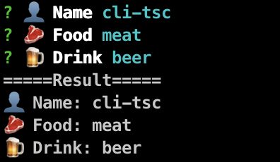

<h1 align="center">Welcome to cli-typescript-starter 👋
</h1>
<p align="center">
 

</p>

<p align="center">
  
  <a href="#" target="_blank">
    
  </a>
</p>


## Install

```sh
npm install
```

## Build

```build
npm run build
```

## Run Watch

```sh
npm run watch
```

## Link CLI to Global

```
npm run link
```

## Cleanup

```clean
npm run clean
```

```cleanall
npm run cleann:alls
```

## Show your support

Give a ⭐️ if this project helped you!

***
_This README was generated with ❤️ by [readme-md-generator](https://github.com/kefranabg/readme-md-generator)_
